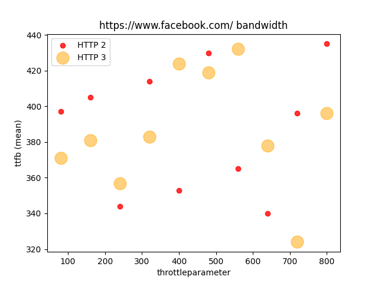
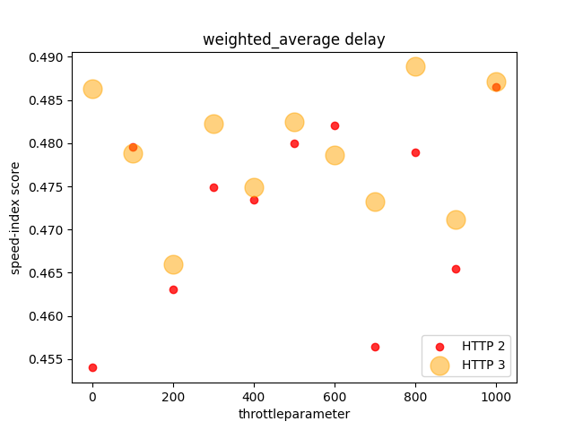

# 50.012 Networks Project Fall 2021 <a name="top"></a>
<p align="center"></p>
<span align="center">


</span>

Team Skrowten presents our networks project for your reference. Kindly cite us if you ever find our results useful.

## Table Of Contents <a name="toc"></a>
- [Networks Project](#top)
  - [Table of Contents](#toc)
  - [Description](#description)
  - [Environment Setup](#envsetup)
  - [Approach](#approach)
  - [Sitespeed bash script](#bashscript)
  - [Data Extraction Python Script](#dataextraction)
  - [Data Analysis](#da)
  - [Results](#results)
  - [Conclusion](#conclusion)
  - [Future Work](#fw)
  - [Contributing](#Contribute)
  - [References](#ref)
  - [Acknowledgements](#acknowledgements)


## Description <a name="description"></a>
This project was completed for Networks module during fall term 2021. Our team explored the comparison between the Quality of Experience (QOEs) between HTTP2 and HTTP3. 

## Approach <a name="approach"></a>
Our group used the ubuntu 20.04.3 environment to run the Netem tools to simulate the various network conditions using three different metrics: bandwidth, packet loss and delay. You can run the script `auto_test_multiple_sites.sh` via the command below. 

Note: The script will take approximately 6 hours to finish running for the specified conditions.

### Environmental setup <a name="envsetup"></a>
Requirements:
- Ubuntu 20.04.03
- Docker <br/>
If you are unsure of how to install Docker on ubuntu, you can refer to [MethylDragon's tutorial](https://github.com/methylDragon/docker-reference/blob/master/01%20Docker%20Crash%20Course.md#2.2).
- Ensure that python3.8 or 3.9 is installed.

To enable the running of the scripts as well as the data analysis section, run the following commands below:
```
git clone https://github.com/caramelmelmel/skrowten.git
```
If you use ssh for git then another command should fit. In this case, our team used HTTPS.

Ensure that you are in the skrowten directory.
```
cd ${PWD}/skrowten
```
```
python3 -m pip install -r requirements.txt
```
To ensure that you have installed all the dependencies, please run
```
pip3 freeze
```

## Sitespeed bash script <a name="bashscript"></a>

### Configs 

Some important variables currently set in the script:

| Variable                | Current Value | Remarks                                                                                      |
| ----------------------- | ------------- | -------------------------------------------------------------------------------------------- |
| networkImpairmentAmount | 0             | starting value for network impairment                                                        |
| delayIntervalSize       | 100           | 100ms per interval, from 0ms to 1000ms                                                       |
| bandwidthIntervalSize   | 80            | 80Mbps per interval, from 80Mbps to 1000Mbps (0Mbps is excluded in the script for bandwidth) |
| packetLossIntervalSize  | 0.15          | 0.15% per interval, from 0% to 1.5%                                                          |
| noOfIntervals           | 11            | Decides how many network impairments we test, starting interval is from 0                    |
| iterations              | 3             | How many repeated runs are done per website test                                             |

### Running the Script
The list of websites that we tested on are in `testing_sites1.txt` and `testing_sites2.txt`.

You can run the script with this command (sudo needed for tc command in script):

```
sudo ./auto_test_multiple_sitespeed.sh
```

You will then be prompted to choose the Network Impairment you want to run the tests on, as well as which txt file you want to use. Our team referred to the assignments below.

| Person                        | Delay  | Packet Loss | Bandwidth |
| ----------------------------- | ------ | ----------- | --------- |
| Person 1 (testing_sites1.txt) | Melody | Song Gee    | Hannah    |
| Person 2 (testing_sites2.txt) | Jerome | Marcus      | Jun Wei   |

### Uploading Files

You don't need to worry about uploading excess files, as the gitignore to has been configured to exclude unnecessary files and only include those needed. You can run the script, and the files will be saved in a folder unique to your assigned configuration, which you can upload in a commit. If you choose the right config, your files should not conflict or overwrite someone else's.

That's all, have fun running the script :D
<br/>
<br/>

## Data Extraction Python Script <a name="dataextraction"></a>

### Overview

The script extracts data that our team has deamed possibly important from each `browsertime.har`, `browsertime.pageSummary.json` and `lighthouse.pageSummary.json` files. These files are produced after each Sitespeed run. The data is then output as a csv file. 

[Separating By Throttle Parameter](#separating-by-throttle-parameter): The script run from `dataExtraction/main.py` allows one to extract data from bandwith, delay and packet loss runs with website text files 1 and 2 defined in the Sitespeed script. 
[Collection for testing sites3 varying delay](#collection-for-testing-sites3-varying-delay): To collect specifically for delay with website text file 3, use `dataExtraction/delay_extraction_main.py`

NOTE: Run this script only after having run the Sitespeed bash script. This script assumes that the locations of said .har and .json files follow the same pattern as the Sitespeed script's output. 

### Pre-requisite
1. Ensure that Pandas is installed. You can refer to the setup [above](#envsetup)

### Separating By Throttle Parameter

#### Using the Git Root Directory

1. In a terminal, set the current directory to that of the parent of the folder `BrowserTimeResults`. BrowserTimeResults would have been produced from running the Sitespeed bash script. By default, this parent directory is this Git repository's root directory.

2. Based on the throttle type and test set that you have run for the Sitespeed bash script, modify the following the command to run this data extraction script. 

```
python3 dataExtraction/main.py THROTTLE_TYPE SITELIST_NUM
```

- Where:

   1. THROTTLE_TYPE is one of 3 possible types
      - packetLoss
      - bandwidth
      - delay

   <br/>

   2. SITELIST_NUM is an integer 
      - 1
      - 2

One possible command for running the script is:

```
python3 dataExtraction/main.py delay 1
```

#### Using a Different Path

1. If the `BrowserTimeResults` folder is in a different directory from the default, you may specify the path to its parent folder as the last parameter.

```
python3 dataExtraction/main.py THROTTLE_TYPE SITELIST_NUM PATH
```

- Where PATH is the full path to the parent dirctory of the `BrowserTimeResults` folder.

For example, if the full path to BrowserTimeResults is `/home/bob/Documents/BrowserTimeResults`, the following command might be used:

```
python3 dataExtraction/main.py delay 1 /home/bob/Documents
```

*Please obtain the common parameters (THROTTLE_TYPE & SITELIST_NUM PATH) in [Using the Git Root Directory](#using-the-git-root-directory) Step 2.*


### Collection for testing sites3 varying delay

#### Using the Git Root Directory

1. In a terminal, set the current directory to that of the parent of the folder `delayRunResults`. delayRunResults would have been produced from running the Sitespeed bash script. By default, this parent directory is this Git repository's root directory.

2. Run the following command

```
python3 dataExtraction/delay_extraction_main.py
```

#### Using a Different Path

1. If the `delayRunResults` folder is in a different directory from the default, you may specify the path to its parent folder as the last parameter.

```
python3 dataExtraction/delay_extraction_main.py PATH
```

- Where PATH is the full path to the parent dirctory of the `delayRunResults` folder.

For example, if the full path to BrowserTimeResults is `/home/bob/Documents/delayRunResults`, the following command might be used:

```
python3 dataExtraction/delay_extraction_main.py /home/bob/Documents
```

### Obtaining the results

1. The script will print out the location of the resulting csv file. You may find the csv there. 

An example output:

```
Cleaned data written to csv file: /home/Documents/Networks/project/skrowten/extract_data/2021-11-25 00:38:30.860606/cleaned_data_2021-11-25 00:38:30.860606.csv
```

## Data Analysis Python Script <a name="da"></a>

### How to Run

1. Get into the directory else the csv file not found error is thrown even if you use dataAnalysis/{file_name}

```
cd ${PWD}/skrowten/dataAnalysis
```

2. You should be able to see a few files that are needed for this script to run:

```
bandwidth.csv
delay.csv
packet_loss.csv
```

If anyone of the above stated files are missing,
run
<br/>

On Mac/Linux:

```
python3 split_metric.py
```

On Windows:

```
python split_metric.py
```

3. The script works on the following flags:
   <br/>
   <br/>
   a. `-m` which means that you can input the metric that you are looking out for
   The only valid arguments are `delay`, `packetLoss` and `bandwidth`. Key in the <span style="background-color:yellow; color:red">exact</span> syntax so that no exceptions are raised.
   <br/>
   <br/>
   b. `-w` write the integer of the website that you want. The manual is as follows:<br/>
   1- google <br/>
   2- facebook <br/>
   3- youtube <br/>
   4- instagram <br/>
   5- vk <br/>
   6- canva <br/>
   7- whatsapp <br/>
   8- forbes <br/>
   9- glassdoor <br/>
   10- live <br/>
   11- average over all websites
   <br/>
   <br/>
   c. `-yaxis` same thing, write the number of the measurement metric that you would like<br/>
   1- speed index score <br/>
   2- lighthouse performance <br/>
   3- ttfb mean (ttfb - time to first byte) <br/>
   4- ttfb median <br/>
   5- domComplete mean <br/>
   6- domComplete median <br/>
   7- fullyLoaded (mean) <br/>
   8- fullyLoaded (median)

d. `-xaxis` write the name of any of the column headers in the excel sheet (eg.`cleaned_data.csv`).

An example of how to call the script would be the following:

```
python3 website_plot.py -m "delay" -w 2 -yaxis 2 -xaxis "throttleparameter"
```
## Results <a name="results"></a>
We produced some test runs and obtained some results. The results are located in the `dataAnalysis/results_graphs` directory. If you would like to view a sample of results, you may go there and view it. One such sample of a scatter plot that we ran on an individual website is shown below.
<p></p>

To get the average performance for all websites, it can be shown in the `dataAnalysis/results_graphs/weighted_average`.
One example plot is shown below:
<p></p>

## Conclusion <a name="conclusion"></a>
1. Running various network conditions, we got random results and we don't seem to see a clear trend. Each metric of measurement is not independent of one another.

2. The ratio of HTTP2 support to HTTP3 support is not 1. This shows how unreliable data collection can be.


## Future Work <a name="fw"></a>
We are looking at the following:
- Running more rounds of our experimental setup.
- Running our simulated tests on the websites that are still in the developmental phase of supporting HTTP 3 or applications that support HTTP 3 (eg. Facebook Lite).
- Doing up a private server which we did not manage to complete due to the lack of time.

## References <a name="ref"></a>
We referred to two of our literature reviews and performed our experiment approaches based on them.

1. M. Trevisan, D. Giordano, I. Drago and A. S. Khatouni, "Measuring HTTP/3: Adoption and Performance," 2021 19th Mediterranean Communication and Computer Networking Conference (MedComNet), 2021, pp. 1-8, doi: 10.1109/MedComNet52149.2021.9501274.

2. Saif, Darius & Lung, Chung-Horng & Matrawy, Ashraf. (2020). An Early Benchmark of Quality of Experience Between HTTP/2 and HTTP/3 using Lighthouse. 

## Contribution <a name="Contribute"></a>
You can read the guidelines in the `Contributing.md`.
## Acknowledgements <a name="acknowledgements"></a>
[Jerome Heng](https://github.com/kraftedcheese)<br/>
[Lim Jun Wei](https://github.com/junwei567)<br/>
[Ang Song Gee](https://github.com/angsg97)<br/>
[Mah Qing Long Hannah Jean](https://github.com/jeanmah)<br/>
[Marcus Ho Jun Wei](https://github.com/marcushojww)<br/>
[Leong Yun Qin Melody](https://github.com/caramelmelmel)<br/>